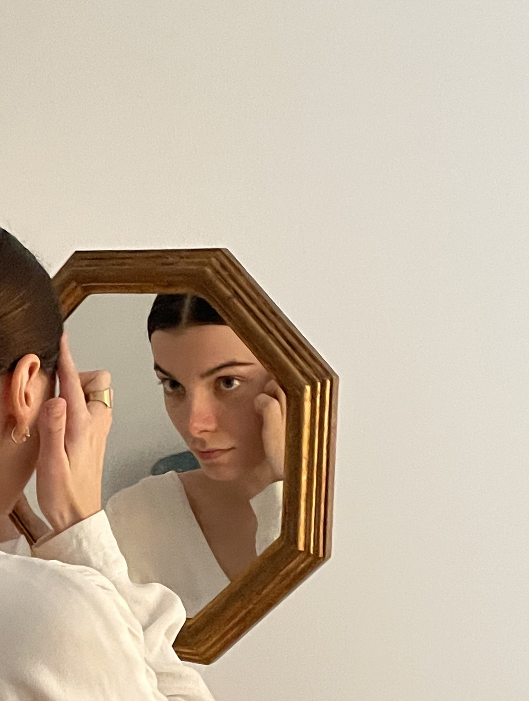
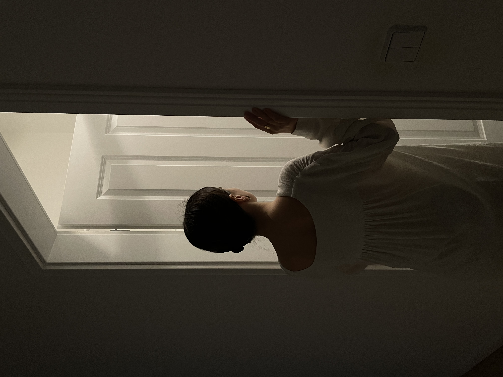

 

Lena Petrova is a Russian-born dancer, martial artist and model based in Berlin.

Her main focus of work are in connecting physical and emotional bodies, moving from trauma to power through storytelling, and finding the authentic "self".

She is a female empowerment activist.